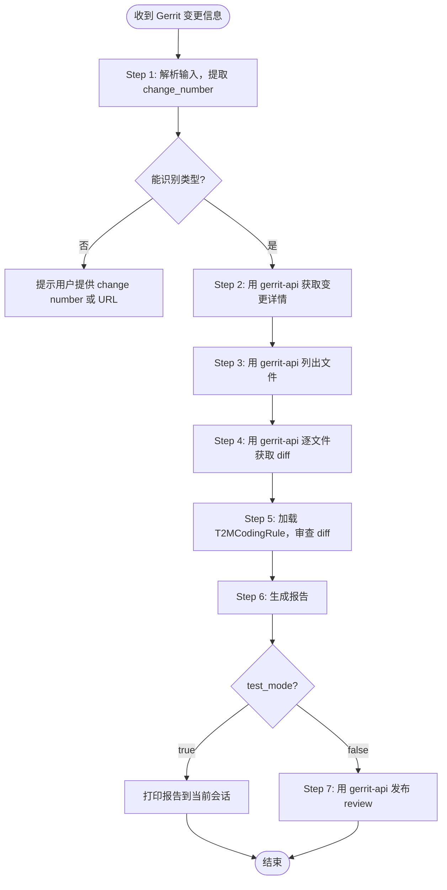

# Code Review Skill

**功能：** 按需 Code Review。收到 Gerrit 变更信息时，通过 **gerrit-api** skill 获取 patch，按 **T2MCodingRule** 审查，生成报告，并可发布回 Gerrit。

**触发条件（收到以下任意内容时使用本 skill）：**
- Gerrit 变更页面链接（`http://...` 或 `https://...`）
- Change number（纯数字，如 `12345`）
- Change-Id（`I` + 40 位十六进制，如 `Iabcdef...`，正则：`^I[0-9a-f]{40}$`）
- Commit SHA（7~40 位十六进制，正则：`^[0-9a-f]{7,40}$`）
- Gerrit stream event JSON 文本

**所有 Gerrit 操作均通过 gerrit-api skill 完成，本 skill 不直接调用 Gerrit API。**

| 脚本 | 用途 | 调用时机 |
|---|---|---|
| `check_env.py` | 检查 gerrit-api 已安装 + code-review 配置存在 | 加载 skill 后运行一次 |

---

## ⚠️ Step 0 — 初始化环境变量（每次会话执行一次）

> 如果遇到路径相关问题，安装 `skill-guide`：
> `npx skills add https://github.com/vancebs/skills --skill skill-guide`

```bash
# Linux / macOS
export SKILL_WORKSPACE="$(pwd)"

# 设置 code-review skill 目录
export SKILL_DIR=$(python3 -c "
import os, sys
from pathlib import Path
name = 'code-review'
ws = Path(os.environ.get('SKILL_WORKSPACE', os.getcwd()))
for p in [ws/'.agents'/'skills'/name, Path.home()/'.agents'/'skills'/name]:
    if p.is_dir():
        print(p); sys.exit(0)
sys.exit(1)
") || echo "ERROR: code-review skill not found — npx skills add https://github.com/vancebs/skills --skill code-review"

# 设置 gerrit-api skill 目录（独立变量，避免与 SKILL_DIR 冲突）
export GERRIT_API_SKILL_DIR=$(python3 -c "
import os, sys
from pathlib import Path
name = 'gerrit-api'
ws = Path(os.environ.get('SKILL_WORKSPACE', os.getcwd()))
for p in [ws/'.agents'/'skills'/name, Path.home()/'.agents'/'skills'/name]:
    if p.is_dir():
        print(p); sys.exit(0)
sys.exit(1)
") || echo "ERROR: gerrit-api skill not found — npx skills add https://github.com/vancebs/skills --skill gerrit-api"
```

```powershell
# Windows PowerShell
$env:SKILL_WORKSPACE = (Get-Location).Path

# 设置 code-review skill 目录
$env:SKILL_DIR = @(
    "$env:SKILL_WORKSPACE\.agents\skills\code-review",
    "$HOME\.agents\skills\code-review"
) | Where-Object { Test-Path $_ } | Select-Object -First 1

# 设置 gerrit-api skill 目录
$env:GERRIT_API_SKILL_DIR = @(
    "$env:SKILL_WORKSPACE\.agents\skills\gerrit-api",
    "$HOME\.agents\skills\gerrit-api"
) | Where-Object { Test-Path $_ } | Select-Object -First 1
if (-not $env:GERRIT_API_SKILL_DIR) {
    Write-Warning "gerrit-api not found. Install: npx skills add https://github.com/vancebs/skills --skill gerrit-api"
}
```

---

## Step 1 — 环境检查（首次加载 skill 时运行一次）

```bash
# Linux / macOS
python3 "$SKILL_DIR/scripts/check_env.py"

# Windows
python "%SKILL_DIR%\scripts\check_env.py"
```

脚本检查：Python 版本、gerrit-api 已安装、GERRIT_API_SKILL_DIR 已设置、code-review 配置文件存在。

**如果 gerrit-api 未安装，脚本会输出安装命令：**
```
❌ gerrit-api skill 未安装（必须安装）
   安装命令: npx skills add https://github.com/vancebs/skills --skill gerrit-api
```

安装后，运行 gerrit-api 的环境检查（配置 Gerrit 连接）：
```bash
python3 "$GERRIT_API_SKILL_DIR/scripts/check_env.py"
```

---

## Step 2 — 创建 code-review 配置文件（一次性）

> ⚠️ **Gerrit 连接配置（host/username/password）在 gerrit-api skill 中管理，不在此处配置。**

```bash
# Linux / macOS
mkdir -p "$SKILL_WORKSPACE/config/code-review"
cp "$SKILL_DIR/scripts/config.json.example" \
   "$SKILL_WORKSPACE/config/code-review/code_review_config.json"
```

```powershell
# Windows PowerShell
New-Item -ItemType Directory -Force "$env:SKILL_WORKSPACE\config\code-review"
Copy-Item "$env:SKILL_DIR\scripts\config.json.example" `
          "$env:SKILL_WORKSPACE\config\code-review\code_review_config.json"
```

配置文件内容：

| 字段 | 必填 | 默认值 | 说明 |
|---|---|---|---|
| `test_mode` | ❌ | `true` | `true` = 仅打印报告，不写 Gerrit；`false` = 发布 comment + Verified 标签 |
| `skip_file_patterns` | ❌ | `[]` | 跳过的文件 glob，如 `["*.md", "*.xml", "*.json"]` |

---

## 📋 工作流（收到 Gerrit 变更信息时执行）



---

### 阶段一 — 解析输入，提取 change_number

根据收到的信息类型，提取 `change_number`（Gerrit 变更的数字 ID）：

| 输入类型 | 提取方法 |
|---|---|
| Gerrit 页面 URL | 从 URL 中提取数字：`/c/proj/+/NUMBER` 或 `#/c/NUMBER` |
| 纯数字 | 直接使用，格式正则：`^\d+$` |
| Change-Id | 格式正则：`^I[0-9a-f]{40}$`，需通过 query 命令查找对应 change number（见下方） |
| Commit SHA | 格式正则：`^[0-9a-f]{7,40}$`，需通过 query 命令查找（见下方） |
| Stream event JSON | 读取 `change.number` 字段；`patchSet.revision` 字段为 commit SHA |

**URL 提取示例：**
```
https://gerrit.example.com/c/platform/frameworks/base/+/12345      → 12345
https://gerrit.example.com/c/platform/frameworks/base/+/12345/2    → 12345（patchset 2）
https://gerrit.example.com/#/c/12345/                              → 12345
```

**通过 Change-Id 查询 change number：**
```bash
python3 "$GERRIT_API_SKILL_DIR/scripts/gerrit_api.py" \
  query "change:Iabcdef1234567890abcdef1234567890abcdef12+limit:1"
```

**通过 commit SHA 查询 change number：**
```bash
python3 "$GERRIT_API_SKILL_DIR/scripts/gerrit_api.py" \
  query "commit:abc123def456+limit:1"
```

---

### 阶段二 — 通过 gerrit-api 获取 Patch 数据

以下命令全部使用 `GERRIT_API_SKILL_DIR`（不是 `SKILL_DIR`）。

#### 2A — 获取变更详情

```bash
python3 "$GERRIT_API_SKILL_DIR/scripts/gerrit_api.py" get-change <change_number>
```

**从输出中提取：**
- `subject` — 提交标题
- `project` — 项目名
- `branch` — 目标分支
- `owner.username` 或 `owner.name` — 提交者
- `current_revision` — 当前 patchset 的 commit SHA（后续步骤需要）

#### 2B — 列出变更文件

```bash
python3 "$GERRIT_API_SKILL_DIR/scripts/gerrit_api.py" list-files <change_number>
```

输出为文件路径列表。跳过以下文件（对应 `skip_file_patterns` 配置）：
- 配置文件（如 `*.json`, `*.xml`, `*.yaml`）按 `skip_file_patterns` 跳过

#### 2C — 获取每个文件的 Diff

对 `list-files` 返回的每个文件路径执行：

```bash
python3 "$GERRIT_API_SKILL_DIR/scripts/gerrit_api.py" \
  get-diff <change_number> "path/to/file.java"
```

**Windows 将 `python3` 替换为 `python`，路径分隔符用 `%`：**
```batch
python "%GERRIT_API_SKILL_DIR%\scripts\gerrit_api.py" get-diff <change_number> "path/to/file.java"
```

收集所有文件的 diff 后，进入阶段三。

---

### 阶段三 — Code Review（对所有收集到的 diff）

加载 **T2MCodingRule** skill，按以下步骤审查。

#### Checklist: 审查前准备

- [ ] `get-change` 已成功，已知 `subject`、`project`、`branch`、`current_revision`
- [ ] `list-files` 已返回文件列表（过滤掉 `skip_file_patterns` 中的文件）
- [ ] 所有文件的 `get-diff` 已完成
- [ ] T2MCodingRule skill 已加载

#### 3A — 提交信息（Commit Message）审查

依据 **T2MCodingRule 一、Git Commit Message 规范**逐条检查：

| 编号    | 检查项                                  | 正则 / 规则                                                                                      | 问题级别       |
| ----- | ------------------------------------ | -------------------------------------------------------------------------------------------- | ---------- |
| CM-1  | 首行格式：`<Issue Key> <Summary>`         | 首行必须匹配 `^\S+\s+\S+.*`，即 Issue Key + 空格 + Summary                                             | 🟠 ERROR   |
| CM-2  | Issue Key 格式                         | `^\[?[A-Z0-9]+-\d+\]?`                                                                       | 🟡 WARNING |
| CM-3  | 首行与正文之间有空行                           | 第 2 行须为空行（如有正文）                                                                              | 🟠 ERROR   |
| CM-4  | 包含 `* Root Cause` 字段                 | 正文中存在 `^\* Root Cause`                                                                       | 🟠 ERROR   |
| CM-5  | 包含 `* Solution` 字段                   | 正文中存在 `^\* Solution`                                                                         | 🟠 ERROR   |
| CM-6  | 包含 `* Test Steps` 字段                 | 正文中存在 `^\* Test Steps`                                                                       | 🟠 ERROR   |
| CM-7  | 包含 `* Test Result` 字段                | 正文中存在 `^\* Test Result`                                                                      | 🟠 ERROR   |
| CM-8  | `* Solution` 描述具体技术改动                | 内容不得为泛化表述（如 "Fix code"、"代码优化"、"按要求修改"）；正则排除：`(?i)(fix code\|代码优化\|按.*要求\|meet.*requirement)` | 🟠 ERROR   |
| CM-9  | 涉及安全变更时有 `* Security Check` 字段       | 若 diff 含安全相关改动，需检查是否包含 `^\* Security Check`                                                  | 🟡 WARNING |
| CM-10 | 涉及兼容性变更时有 `* Compatibility Check` 字段 | 若 diff 含接口/API 改动，需检查是否包含 `^\* Compatibility Check`                                          | 🟡 WARNING |
| CM-11 | 涉及 AOSP 框架/系统服务/架构变更时引用 ADR          | commit message 中包含 ADR 文档引用                                                                  | 🔵 INFO    |

> **注意：** `get-change` 返回的 `subject` 字段仅为首行。如需检查完整 commit message，可在报告中注明"无法获取完整 message"并仅基于 subject 审查 CM-1 ~ CM-3。

#### 3B — 文件 Diff 审查

**只审查 diff 中新增/修改的行（`+` 开头的行）**，根据扩展名选择规范：

| 扩展名 | 规范 |
|---|---|
| `.java` | T2MCodingRule 四（Java 编码规范）|
| `.c`, `.h` | T2MCodingRule 五（C 编码规范）|
| `.cpp`, `.cc`, `.hpp` | T2MCodingRule 六（C++ 编码规范）|
| 其他 | 通用质量检查 |

审查重点：
- [ ] 命名规范（类/变量/函数）
- [ ] 注释完整性（公共 API、复杂逻辑）
- [ ] 安全规范（T2MCodingRule 七）：无硬编码密码、日志无敏感信息
- [ ] 兼容性规范（T2MCodingRule 八）：无废弃 API、接口向后兼容
- [ ] 逻辑错误、资源泄漏、死锁风险

#### 3C — 问题定级与 PASS/FAIL 判断

| 级别 | 说明 | 影响结果 |
|---|---|---|
| 🔴 CRITICAL | 编译错误、安全漏洞、严重数据风险 | 导致 FAIL |
| 🟠 ERROR | 违反 T2MCodingRule 强制规则 | 导致 FAIL |
| 🟡 WARNING | 建议改进、风格问题 | 不影响 PASS/FAIL |
| 🔵 INFO | 可选建议 | 不影响 PASS/FAIL |

**判断：** 有任意 🔴 或 🟠 → **FAIL**，否则 **PASS**。

#### 3D — 生成报告（固定格式）

> ⚠️ **严格按以下格式输出报告，不得附加任何格式外的文字、解释、前言或后记。**

```
============================
Code Review 报告
============================
变更：#{change_number} — {subject}
项目：{project}  分支：{branch}
提交人：{uploader}
审查结果：【PASS】 或 【FAIL】
============================

## 提交信息审查

[{级别}] {CM编号} {问题描述}
→ 原因：{违反的规范条目，如 "T2MCodingRule 1.3: Solution 字段描述不具体"}
→ 建议：{具体修改建议}

（无问题时写 "✅ 符合规范"）

## 文件审查

### {file_path}
[{级别}] 行 {line}: {问题描述}
→ 原因：{违反的规范条目}
→ 建议：{具体修改建议}

（无问题时写 "✅ 无问题"）

============================
汇总：🔴 {n}  🟠 {n}  🟡 {n}  🔵 {n}
============================
```

**级别标记说明：**

| 写法 | 含义 |
|---|---|
| `[🔴 CRITICAL]` | 安全漏洞、编译错误 |
| `[🟠 ERROR]` | 违反强制规则 |
| `[🟡 WARNING]` | 建议改进 |
| `[🔵 INFO]` | 可选建议 |

**报告输出规则（严格执行）：**
- 报告以第一行 `============================` 开始，以最后一行 `============================` 结束
- 报告正文以外**不得输出任何其他内容**（无引言、无总结段落、无 markdown 代码块包裹）
- `## 提交信息审查` 和 `## 文件审查` 两节均必须存在，不得省略
- 每个问题项必须包含 `→ 原因` 和 `→ 建议` 两行

---

### 阶段四 — 发布结果

读取 code-review 配置文件中的 `test_mode` 值（默认 `true`）：

#### 4A — test_mode = true（默认）

直接将报告打印到当前会话，**不操作 Gerrit**。

#### 4B — test_mode = false

用 gerrit-api 发布 review comment 并设置 Verified 标签：

```bash
# PASS：Verified=0，发布 comment
python3 "$GERRIT_API_SKILL_DIR/scripts/gerrit_api.py" \
  review <change_number> current \
  '{"message": "<报告文本>", "labels": {"Verified": 0}, "tag": "code-review-agent"}'

# FAIL：Verified=-1，发布 comment
python3 "$GERRIT_API_SKILL_DIR/scripts/gerrit_api.py" \
  review <change_number> current \
  '{"message": "<报告文本>", "labels": {"Verified": -1}, "tag": "code-review-agent"}'
```

**报告文本较长时（推荐），先写文件再传入：**

```bash
# 将报告写入临时文件
python3 -c "
import sys, json
report = '''
{报告文本}
'''.strip()
print(json.dumps({'message': report, 'labels': {'Verified': 0}, 'tag': 'code-review-agent'}))
" > /tmp/review_body.json

python3 "$GERRIT_API_SKILL_DIR/scripts/gerrit_api.py" \
  review <change_number> current "$(cat /tmp/review_body.json)"
```

```powershell
# Windows PowerShell
$body = @{
    message = @"
{报告文本}
"@
    labels  = @{ Verified = 0 }
    tag     = "code-review-agent"
} | ConvertTo-Json -Compress

python "$env:GERRIT_API_SKILL_DIR\scripts\gerrit_api.py" review <change_number> current $body
```

**gerrit-api review 命令退出码：**

| 退出码 | 含义 | 后续动作 |
|---|---|---|
| `0` | 成功提交到 Gerrit | 完成 |
| 非 0 | 提交失败（详见 stderr）| 检查权限或网络 |

---

## 异常处理

| 异常情况 | 触发条件 | 处理动作 |
|---|---|---|
| gerrit-api 未安装 | `check_env.py` 输出 ❌ | 运行安装命令后重新检查 |
| GERRIT_API_SKILL_DIR 未设置 | 调用 gerrit_api.py 报错 | 重新执行 Step 0 |
| `get-change` 返回空或错误 | change_number 不存在 | 确认 change_number 正确 |
| `list-files` 返回空 | 纯文档变更 | 输出"无代码文件，跳过审查" |
| `get-diff` 失败 | 文件已删除或 revision 不对 | 跳过该文件，继续其他文件 |
| `query` 无结果 | Change-Id 或 commit SHA 不存在 | 提示用户确认信息来源 |
| `review` 返回 HTTP 401 | gerrit-api password 配置错误 | 运行 `gerrit-api` 的 check_env.py 重新配置 |
| `review` 返回 HTTP 403 | 账号无 Verified 权限 | 联系 Gerrit 管理员授权 |

## ⛔ 约束与禁止事项

### 不支持的场景

| 场景 | 原因 | 处理动作 |
|---|---|---|
| 输入无法解析为任何已知类型 | URL 格式非标准、JSON 结构不匹配 | 停止并提示用户提供 change number（纯数字）或标准 Gerrit URL |
| `query` 返回 0 条结果 | Change-Id / commit SHA 不在此 Gerrit 实例 | 停止并提示"在此 Gerrit 实例中未找到对应变更，请确认信息来源" |
| `query` 返回多条结果 | 不同项目含相同 Change-Id 的历史提交 | 使用第一条，日志输出 WARNING；若结果超过 5 条则停止并请用户提供 change number |
| 所有文件被 `skip_file_patterns` 过滤 | 纯文档/配置变更 | 输出"所有文件均被跳过，无可审查代码文件"，**PASS**（不 FAIL） |
| `get-diff` 对二进制文件或新增文件返回空 | 二进制内容不可 diff | 跳过该文件，报告中标注"[🔵 INFO] 二进制文件，跳过审查" |
| current_revision 在 `get-change` 和 `review` 之间发生变化（新 patchset 上传） | 时序竞争 | `review` 使用 `current` 关键字（不固定 revision），gerrit-api 自动指向当前最新 patchset |
| `review` 返回 HTTP 5xx 或网络超时 | gerrit 服务端故障 | 最多重试 2 次，超限后输出错误，**不**标记 Verified |
| gerrit-api skill 未安装 | 依赖缺失 | 停止并输出：`❌ 需要 gerrit-api skill。安装命令: npx skills add https://github.com/vancebs/skills --skill gerrit-api` |

### 明确禁止的操作

- ⛔ **禁止在 `current_revision` 未确认时调用 `review`**：必须先执行 `get-change` 获得成功响应
- ⛔ **禁止对 `status: ABANDONED` 或 `status: MERGED` 的变更设置 Verified 标签**：可发 comment 但不设标签
- ⛔ **禁止在 test_mode = false 时对同一 change+patchset 重复发布结果**：非幂等，会产生重复评论
- ⛔ **禁止将 diff 内容（含用户代码）发送到外部服务或第三方 API**

### 幂等性声明

| 操作 | 幂等性 | 说明 |
|---|---|---|
| 解析输入 / 获取 patch | ✅ 幂等 | 只读操作 |
| `review`（发布报告） | ❌ 非幂等 | 每次调用均追加 comment；由 cron/调用方负责去重 |

---

## 配置参考

### code-review 配置文件搜索路径（优先级从高到低）

| 优先级 | 路径 |
|---|---|
| 1 ✅ 推荐 | `{workspace}/config/code-review/code_review_config.json` |
| 2 | `{workspace}/config/code_review_config.json` |
| 3 | `{workspace}/code_review_config.json` |
| 4 | `{skill-dir}/code_review_config.json` |
| 5 | `$HOME/.config/code-review/code_review_config.json` |
| 6 | `$HOME/.config/code_review_config.json` |
| 7 | `$HOME/code_review_config.json` |

> Gerrit 连接配置（host/username/password）在 **gerrit-api** skill 的配置文件中管理。

---

## 与其他 skill 的关系

| Skill | 关系 | 说明 |
|---|---|---|
| `gerrit-api` | **必须** | 所有 Gerrit 操作（get-change/list-files/get-diff/review）均通过它完成 |
| `T2MCodingRule` | **必须** | 提供审查规范 |
| `agent-code-review` | 互补 | `agent-code-review` 自带轮询；本 skill 专注按需单次审查 |
| `skill-guide` | 建议安装 | 解决 SKILL_DIR/GERRIT_API_SKILL_DIR 路径问题 |

---

## 文件清单

```
code-review/
├── SKILL.md
├── README.md
└── scripts/
    ├── check_env.py          ← 环境检查（验证 gerrit-api 已安装）
    └── config.json.example  ← 审查行为配置模板（无 Gerrit 连接配置）
```
