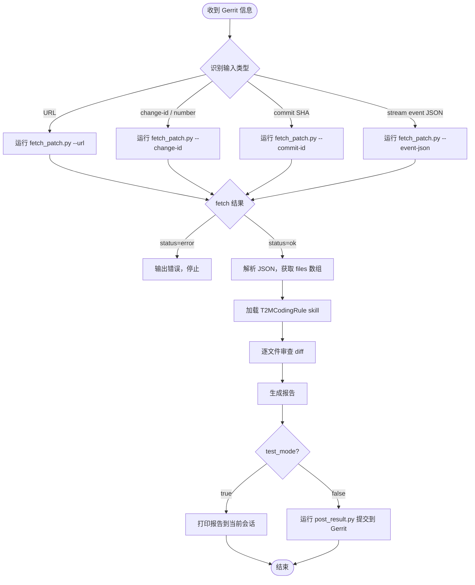

# Code Review Skill

**功能：** 按需 Code Review。当 agent 收到 Gerrit 提交相关信息时，自动获取 patch，按 T2Mobile 编码规范审查，生成报告，并可发布回 Gerrit。

**触发条件（收到以下任意内容时使用本 skill）：**
- Gerrit 变更页面链接（`http://...` 或 `https://...`）
- Gerrit change number（纯数字，如 `12345`）
- Gerrit Change-Id（`I` + 40位十六进制，如 `Iabcdef...`）
- Commit SHA（7~40位十六进制）
- Gerrit stream event JSON 文本（来自其他 agent 传入）

**脚本（Python stdlib，无需 pip）：**

| 脚本 | 用途 | 调用时机 |
|---|---|---|
| `check_env.py` | 环境 & 依赖检查，输出 ✅/❌ | 加载 skill 后运行一次 |
| `fetch_patch.py` | 解析输入 → 调用 Gerrit REST → 返回 patch JSON | 每次 review 前调用 |
| `post_result.py` | 提交 review 结果到 Gerrit | LLM 完成审查后调用 |

---

## ⚠️ Step 0 — 初始化环境变量（每次会话执行一次）

> 如果遇到路径相关问题，安装 `skill-guide`：
> `npx skills add https://github.com/vancebs/skills --skill skill-guide`

```bash
# Linux / macOS / Git Bash
export SKILL_WORKSPACE="$(pwd)"
export SKILL_DIR=$(python3 -c "
import os, sys
from pathlib import Path
name = 'code-review'
ws = Path(os.environ.get('SKILL_WORKSPACE', os.getcwd()))
for p in [ws/'.agents'/'skills'/name, Path.home()/'.agents'/'skills'/name]:
    if p.is_dir():
        print(p); sys.exit(0)
sys.exit(1)
") || echo "ERROR: skill not found — npx skills add https://github.com/vancebs/skills --skill code-review"
```

```powershell
# Windows PowerShell
$env:SKILL_WORKSPACE = (Get-Location).Path
$skillName = 'code-review'
$env:SKILL_DIR = @(
    "$env:SKILL_WORKSPACE\.agents\skills\$skillName",
    "$HOME\.agents\skills\$skillName"
) | Where-Object { Test-Path $_ } | Select-Object -First 1
if (-not $env:SKILL_DIR) { Write-Error "Skill '$skillName' not found" }
```

---

## Step 1 — 环境检查（首次加载 skill 时运行一次）

```bash
# Linux / macOS
python3 "$SKILL_DIR/scripts/check_env.py"

# Windows
python "%SKILL_DIR%\scripts\check_env.py"
```

**所有项显示 ✅ 后继续。** 按输出提示逐一解决 ❌ 项。

---

## Step 2 — 创建配置文件（一次性）

```bash
# Linux / macOS
mkdir -p "$SKILL_WORKSPACE/config/code-review"
cp "$SKILL_DIR/scripts/config.json.example" \
   "$SKILL_WORKSPACE/config/code-review/code_review_config.json"
```

```powershell
# Windows PowerShell
New-Item -ItemType Directory -Force "$env:SKILL_WORKSPACE\config\code-review"
Copy-Item "$env:SKILL_DIR\scripts\config.json.example" `
          "$env:SKILL_WORKSPACE\config\code-review\code_review_config.json"
```

```batch
:: Windows CMD
mkdir "%SKILL_WORKSPACE%\config\code-review"
copy "%SKILL_DIR%\scripts\config.json.example" ^
     "%SKILL_WORKSPACE%\config\code-review\code_review_config.json"
```

用编辑器打开配置文件并填写真实值：

| 字段 | 必填 | 默认值 | 说明 |
|---|---|---|---|
| `url` | ✅ | — | Gerrit 地址，如 `https://gerrit.example.com` |
| `username` | ✅ | — | Gerrit 用户名 |
| `password` | ✅ | — | HTTP Credentials token<br>生成：Gerrit → Settings → HTTP Credentials → Generate Password |
| `test_mode` | ❌ | `true` | `true` = 仅打印报告，不写 Gerrit；`false` = 发布到 Gerrit |
| `skip_file_patterns` | ❌ | `[]` | 跳过的文件 glob，如 `["*.md", "*.xml"]` |

> ⚠️ 将配置文件加入 `.gitignore`：`config/code-review/code_review_config.json`

重新运行 `check_env.py` 确认所有项 ✅ 后继续。

---

## 📋 工作流（收到 Gerrit 变更信息时执行）



---

### 阶段一 — 获取 Patch 数据

根据收到的信息类型，运行对应命令：

```bash
# 输入类型 A：Gerrit 变更页面 URL
python3 "$SKILL_DIR/scripts/fetch_patch.py" \
  --workspace "$SKILL_WORKSPACE" \
  --url "https://gerrit.example.com/c/project/+/12345"

# 输入类型 B：change number（纯数字）
python3 "$SKILL_DIR/scripts/fetch_patch.py" \
  --workspace "$SKILL_WORKSPACE" \
  --change-id 12345

# 输入类型 C：Change-Id（I + 40 位十六进制）
# 格式正则: ^I[0-9a-f]{40}$
python3 "$SKILL_DIR/scripts/fetch_patch.py" \
  --workspace "$SKILL_WORKSPACE" \
  --change-id Iabcdef1234567890abcdef1234567890abcdef12

# 输入类型 D：commit SHA
# 格式正则: ^[0-9a-f]{7,40}$
python3 "$SKILL_DIR/scripts/fetch_patch.py" \
  --workspace "$SKILL_WORKSPACE" \
  --commit-id abc123def456

# 输入类型 E：stream event JSON 文本
python3 "$SKILL_DIR/scripts/fetch_patch.py" \
  --workspace "$SKILL_WORKSPACE" \
  --event-json '{"type":"patchset-created","change":{"number":12345,...},...}'
```

**Windows 将 `python3` 替换为 `python`，路径分隔符用 `\`：**
```batch
python "%SKILL_DIR%\scripts\fetch_patch.py" --workspace "%SKILL_WORKSPACE%" --change-id 12345
```

**输出 JSON 结构：**

```json
{
  "status":          "ok",
  "change_number":   12345,
  "change_id":       "Iabcdef...40hex",
  "revision":        "abc123...40hex",
  "patchset_number": 1,
  "project":         "org/repo",
  "branch":          "main",
  "subject":         "Fix login bug",
  "uploader":        "john.doe",
  "commit_message":  "Fix login bug\n\nChange-Id: I...",
  "files": [
    {
      "path":   "src/main/java/Foo.java",
      "status": "MODIFIED",
      "diff":   "--- a/src/...\n+++ b/src/..."
    }
  ]
}
```

**判断下一步：**
- `status == "error"` → 输出 stderr 中的错误信息，停止本次执行
- `status == "ok"`, `files` 为空 → 输出"无文件变更，跳过审查"
- `status == "ok"`, `files` 非空 → 进入 Code Review（阶段二）

---

### 阶段二 — Code Review

加载 **T2MCodingRule** skill，按以下步骤审查。

#### Checklist: 审查前准备

- [ ] `fetch_patch.py` 输出 `status == "ok"`
- [ ] `files` 数组非空
- [ ] T2MCodingRule skill 已加载
- [ ] 已知 `change_number` 和 `revision`（后续提交需要）

#### 2A — 提交信息（Commit Message）审查

检查 `commit_message` 字段：

| 检查项 | 正则/规则 | 问题级别 |
|---|---|---|
| 格式：`type(scope): subject` | `^(feat\|fix\|refactor\|docs\|test\|chore\|style\|perf)(\(.+\))?: .+` | 🟠 ERROR |
| subject 长度 ≤ 50 字符 | subject 部分（首行冒号后）字符数 | 🟡 WARNING |
| 不以句号结尾 | subject 末尾不为 `[.。]` | 🟡 WARNING |
| 包含 Jira ID（如存在）| `Issue: [A-Z]+-\d+` | 🔵 INFO |

#### 2B — 文件 Diff 审查

对 `files` 数组中每个文件，根据扩展名选择对应规范：

| 扩展名 | 规范 |
|---|---|
| `.java` | T2MCodingRule 四（Java 编码规范）|
| `.c`, `.h` | T2MCodingRule 五（C 编码规范）|
| `.cpp`, `.cc`, `.hpp` | T2MCodingRule 六（C++ 编码规范）|
| 其他 | 通用质量检查 |

审查重点（仅审查 diff 中新增/修改的行，即 `+` 开头的行）：

- [ ] 命名规范（类/变量/函数）
- [ ] 注释完整性（公共 API、复杂逻辑）
- [ ] 安全规范（T2MCodingRule 七）：无硬编码密码、日志无敏感信息
- [ ] 兼容性规范（T2MCodingRule 八）：无废弃 API、接口向后兼容
- [ ] 逻辑错误、资源泄漏、死锁风险

#### 2C — 问题定级

| 级别 | 说明 | 对最终结果影响 |
|---|---|---|
| 🔴 CRITICAL | 编译错误、安全漏洞、严重数据风险 | 导致 FAIL |
| 🟠 ERROR | 违反 T2MCodingRule 强制规则 | 导致 FAIL |
| 🟡 WARNING | 建议改进、风格问题 | 不影响 PASS/FAIL |
| 🔵 INFO | 可选建议 | 不影响 PASS/FAIL |

**判断 PASS / FAIL：** 有任意 🔴 或 🟠 → **FAIL**，否则 **PASS**。

#### 2D — 生成报告（固定格式）

```
============================
Code Review 报告
============================
变更：#{change_number} — {subject}
项目：{project}  分支：{branch}
Patchset：{patchset_number}  提交人：{uploader}
审查结果：【PASS】 或 【FAIL】
============================

## 提交信息审查
{问题列表，或"✅ 符合规范"}

## 文件审查

### {file_path} ({status})
[{级别}] 行 {line}: {问题描述}
→ 原因：{违反的规范条目}
→ 建议：{具体修改建议}

（无问题时写 "✅ 无问题"）

============================
汇总：🔴 {n}  🟠 {n}  🟡 {n}  🔵 {n}
============================
```

---

### 阶段三 — 提交结果

```bash
# 方式一：报告内容较短时，直接内联
python3 "$SKILL_DIR/scripts/post_result.py" \
  --workspace "$SKILL_WORKSPACE" \
  --change-id {change_number} \
  --revision  {revision} \
  --result    {PASS 或 FAIL} \
  --report    "{报告文本}"

# 方式二：报告较长时，先写文件再传入（推荐）
# Linux / macOS
cat > /tmp/cr_report.txt << 'REPORT'
{报告内容}
REPORT
python3 "$SKILL_DIR/scripts/post_result.py" \
  --workspace "$SKILL_WORKSPACE" \
  --change-id {change_number} \
  --revision  {revision} \
  --result    {PASS 或 FAIL} \
  --report-file /tmp/cr_report.txt

# Windows PowerShell（将报告保存为文件再传入）
$report | Out-File -Encoding utf8 "$env:TEMP\cr_report.txt"
python "$env:SKILL_DIR\scripts\post_result.py" `
  --workspace "$env:SKILL_WORKSPACE" `
  --change-id {change_number} `
  --revision  {revision} `
  --result    {PASS 或 FAIL} `
  --report-file "$env:TEMP\cr_report.txt"
```

**退出码说明：**

| 退出码 | 含义 | 后续动作 |
|---|---|---|
| `0` | 成功（已提交到 Gerrit） | 完成 |
| `1` | 提交失败 | 查看 stderr，修复后重试 |
| `2` | test_mode 激活，未提交 | 将 `test_mode` 改为 `false` 或加 `--force` |

---

## 异常处理

| 异常情况 | 触发条件 | 处理动作 |
|---|---|---|
| `fetch_patch.py` 输出 `status=error` | Gerrit 连接失败或找不到变更 | 查看 stderr，检查 config 和网络 |
| `无法从 URL 中解析 change number` | URL 格式不符 | 改用 `--change-id` 传入纯数字 |
| `HTTP 401` | password 配置错误 | 重新生成 HTTP Credentials |
| `HTTP 403` | 账号无 Verified 权限 | 联系 Gerrit 管理员授权 |
| SSL 错误 | 自签名证书 | 脚本自动重试（禁用 SSL 验证） |
| `files` 为空 | 纯文档/配置变更 | 输出"无代码文件，跳过审查" |

---

## 配置参考

### 配置文件搜索路径（优先级从高到低）

| 优先级 | 路径 |
|---|---|
| 1 ✅ 推荐 | `{workspace}/config/code-review/code_review_config.json` |
| 2 | `{workspace}/config/code_review_config.json` |
| 3 | `{workspace}/code_review_config.json` |
| 4 | `{skill-dir}/code_review_config.json` |
| 5 | `$HOME/.config/code-review/code_review_config.json` |
| 6 | `$HOME/.config/code_review_config.json` |
| 7 | `$HOME/code_review_config.json` |

---

## 与其他 skill 的关系

| Skill | 关系 | 说明 |
|---|---|---|
| `gerrit-api` | 推荐安装 | 提供更多 Gerrit 操作能力；`fetch_patch.py` 自身已内置必要 REST 调用 |
| `T2MCodingRule` | 必须加载 | 提供审查规范（阶段二依赖） |
| `agent-code-review` | 互补 | `agent-code-review` 自带事件轮询；本 skill 专注按需审查 |
| `skill-guide` | 建议安装 | 解决路径和 SKILL_DIR 相关问题 |

---

## 文件清单

```
code-review/
├── SKILL.md
├── README.md
└── scripts/
    ├── check_env.py          ← 环境检查（首次运行）
    ├── fetch_patch.py        ← 获取 patch 数据（每次 review 前运行）
    ├── post_result.py        ← 提交 review 结果到 Gerrit
    └── config.json.example  ← 配置模板
```
