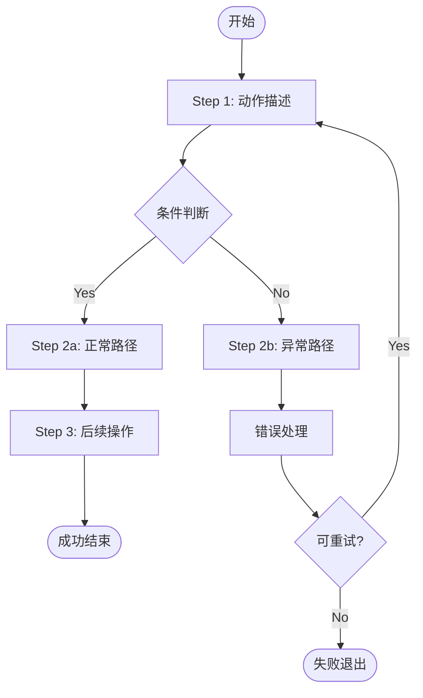

# Skill 使用指引（Skill Guide）

**本 Skill 的目的：** 帮助 agent 正确调用其他 skill，避免能力较弱的模型常见错误。

**何时需要阅读本指引：**
- 首次使用任何 skill 时
- 遇到"文件找不到"、"配置未加载"等路径相关错误时
- 在会话中执行了 `cd` 之后调用 skill 时
- 跨平台（Windows / Linux / macOS）使用 skill 时

---

## ⚠️ 关键概念：三个根目录

在调用 skill 时，始终需要区分以下三个不同的目录。**混淆它们是能力较弱的模型最常见的错误来源。**

| 变量                | 含义                 | 典型路径                                                                                       | 用于               |
| ----------------- | ------------------ | ------------------------------------------------------------------------------------------ | ---------------- |
| `SKILL_WORKSPACE` | Agent 的**项目工作目录**  | `/home/user/myproject`                                                                     | 配置文件、输出文件、日志     |
| `SKILL_DIR`       | **当前 skill 的安装目录** | `/home/user/myproject/.agents/skills/gerrit-api`或者``/home/user/.agents/skills/gerrit-api`` | 该 skill 自带的脚本和文件 |
| `$HOME`           | 用户主目录              | `/home/user`                                                                               | 全局配置、全局安装的 skill |

> ❌ **错误做法：** 以 `pwd` 或相对路径调用 skill 脚本，或以 `pwd` 拼接配置文件路径。
>
> ✅ **正确做法：** 调用脚本时用 `$SKILL_DIR`，查找配置时用 `$SKILL_WORKSPACE`。

---

## ✅ 每次会话开始必做（Pre-session Checklist）

在使用任何 skill 之前，**必须**完成以下步骤。这是所有后续操作的基础。

### Step 1 — 记录 Workspace

> **为什么：** 如果之后执行了 `cd`，`pwd` 会变化，但 `SKILL_WORKSPACE` 不变。

```bash
# Linux / macOS / Git Bash
export SKILL_WORKSPACE="$(pwd)"

# Windows CMD
set SKILL_WORKSPACE=%CD%

# Windows PowerShell
$env:SKILL_WORKSPACE = (Get-Location).Path
```

**记住：一旦设置，整个会话中不要再修改它。**

### Step 2 — 确认 Skill 安装目录

对每一个即将使用的 skill，检测并设置其 `SKILL_DIR`。

**自动检测（推荐，跨平台）：**

```python
# 将下方代码保存为临时文件后运行，或作为 python3 -c 的内容
import os, sys
from pathlib import Path

skill_name = "your-skill-name"  # ← 替换为实际 skill 名称
ws = Path(os.environ.get("SKILL_WORKSPACE", os.getcwd()))

search_paths = [
    ws / ".agents" / "skills" / skill_name,       # workspace-local 安装
    Path.home() / ".agents" / "skills" / skill_name,  # 全局安装
]

for p in search_paths:
    if p.is_dir():
        print(p)
        sys.exit(0)

print(f"ERROR: skill '{skill_name}' not found in:", file=sys.stderr)
for p in search_paths:
    print(f"  {p}", file=sys.stderr)
sys.exit(1)
```

**设置 SKILL_DIR：**

```bash
# Linux / macOS（将 gerrit-api 替换为实际 skill 名称）
export SKILL_DIR=$(python3 -c "
import os, sys
from pathlib import Path
name = 'gerrit-api'
ws = Path(os.environ.get('SKILL_WORKSPACE', os.getcwd()))
for p in [ws/'.agents'/'skills'/name, Path.home()/'.agents'/'skills'/name]:
    if p.is_dir():
        print(p); sys.exit(0)
sys.exit(1)
") || echo "ERROR: skill not found — run install command"

# Windows PowerShell
$skillName = 'gerrit-api'
$env:SKILL_DIR = @(
    "$env:SKILL_WORKSPACE\.agents\skills\$skillName",
    "$HOME\.agents\skills\$skillName"
) | Where-Object { Test-Path $_ } | Select-Object -First 1
if (-not $env:SKILL_DIR) { Write-Error "Skill '$skillName' not found" }
```

> 如果 agent 平台会自动设置 `SKILL_DIR`，跳过此步骤。

### Step 3 — 验证环境变量已设置

```bash
# 验证两个变量都已设置且目录存在
python3 -c "
import os
from pathlib import Path
ws = os.environ.get('SKILL_WORKSPACE', '')
sd = os.environ.get('SKILL_DIR', '')
print('SKILL_WORKSPACE:', ws or '[未设置]', '  exists:', Path(ws).is_dir() if ws else False)
print('SKILL_DIR      :', sd or '[未设置]', '  exists:', Path(sd).is_dir() if sd else False)
"
```

---

## 📍 文件路径使用规范

### 规则 1：调用 Skill 自带脚本 → 用 `$SKILL_DIR`

```bash
# ✅ 正确
python3 "$SKILL_DIR/scripts/gerrit_api.py" query "status:open"

# ❌ 错误 — 如果 cd 过，相对路径失效
python3 scripts/gerrit_api.py query "status:open"

# ❌ 错误 — SKILL_WORKSPACE 是项目目录，不是 skill 目录
python3 "$SKILL_WORKSPACE/scripts/gerrit_api.py" query "status:open"
```

### 规则 2：读取/创建配置文件 → 用 `$SKILL_WORKSPACE`

```bash
# ✅ 正确 — 配置文件在项目目录下
mkdir -p "$SKILL_WORKSPACE/config/gerrit-api"
cp "$SKILL_DIR/scripts/gerrit_config.json.example" \
   "$SKILL_WORKSPACE/config/gerrit-api/gerrit_config.json"

# ❌ 错误 — 不能保证 pwd 正确
mkdir -p config/gerrit-api
```

### 规则 3：配置文件搜索顺序（Python 中）

当 skill 的 Python 脚本搜索配置文件时，标准搜索顺序如下（从高到低）：

```python
from pathlib import Path
import os

def find_config(filename: str, skill_name: str) -> Path | None:
    ws = Path(os.environ.get("SKILL_WORKSPACE", os.getcwd()))
    sd = Path(os.environ.get("SKILL_DIR", Path(__file__).parent.parent))
    home = Path.home()

    candidates = [
        ws / "config" / skill_name / filename,   # ← 推荐创建位置
        ws / "config" / filename,
        ws / filename,
        sd / filename,                            # skill 自带示例
        home / ".config" / skill_name / filename,
        home / ".config" / filename,
        home / filename,
    ]
    for p in candidates:
        if p.is_file():
            return p
    return None
```

> **推荐配置文件位置：** `{SKILL_WORKSPACE}/config/{skill-name}/{config-file}`

### 规则 4：输出文件和日志 → 用 `$SKILL_WORKSPACE`

```bash
# ✅ 正确 — 输出到项目目录
python3 "$SKILL_DIR/scripts/stream.py" --output "$SKILL_WORKSPACE/events.jsonl"

# ❌ 错误
python3 "$SKILL_DIR/scripts/stream.py" --output events.jsonl
```

---

## 📋 调用 Skill 前逐项检查清单

在调用任何 skill 的命令之前，依次确认：

- [ ] `SKILL_WORKSPACE` 已设置为项目根目录的**绝对路径**
- [ ] `SKILL_DIR` 已指向目标 skill 的**安装目录绝对路径**
- [ ] `python3 --version` 输出 ≥ 3.9（部分 skill 要求）
- [ ] skill 要求的配置文件已存在（路径：`$SKILL_WORKSPACE/config/{skill-name}/`）
- [ ] 所有脚本调用使用 `python3 "$SKILL_DIR/scripts/..."` 形式
- [ ] 所有配置/输出路径使用 `"$SKILL_WORKSPACE/..."` 形式
- [ ] 如果即将执行 `cd`：确保 `SKILL_WORKSPACE` 和 `SKILL_DIR` 已提前设置

---

## 🐛 常见错误与修复

### 错误 1：文件找不到（FileNotFoundError / No such file or directory）

**原因：** 在会话中执行了 `cd`，导致相对路径失效。

**排查步骤：**
```bash
# 检查当前目录
pwd

# 检查是否和 SKILL_WORKSPACE 一致
echo $SKILL_WORKSPACE

# 如果不一致，重新设置（但要保持原来的值！）
# 不要用 "$(pwd)" — 此时 pwd 已经是错误的目录
```

**修复：** 在会话最开始执行 Step 1（记录 Workspace），之后永远不修改它。

---

### 错误 2：Config file not found / 配置文件未加载

**原因：** 配置文件不在搜索路径上，或 `SKILL_WORKSPACE` 指向错误目录。

**排查步骤：**
```python
# 运行此诊断代码（替换 skill_name 和 config_filename）
import os
from pathlib import Path

skill_name = "gerrit-api"
config_filename = "gerrit_config.json"
ws = Path(os.environ.get("SKILL_WORKSPACE", os.getcwd()))
sd = Path(os.environ.get("SKILL_DIR", "."))
home = Path.home()

candidates = [
    ws / "config" / skill_name / config_filename,
    ws / "config" / config_filename,
    ws / config_filename,
    sd / config_filename,
    home / ".config" / skill_name / config_filename,
    home / ".config" / config_filename,
    home / config_filename,
]

for p in candidates:
    status = "✅ EXISTS" if p.is_file() else "❌ not found"
    print(f"{status}  {p}")
```

**修复：** 在 `✅ EXISTS` 最高优先级路径创建配置文件。

---

### 错误 3：Permission denied / 脚本无法执行

**原因：** Python 脚本没有执行权限（Linux/macOS），或 Python 版本不对。

**修复：**
```bash
# 检查 Python 版本
python3 --version

# 始终使用 "python3 script.py" 形式，不要直接执行 "./script.py"
# ✅ 正确
python3 "$SKILL_DIR/scripts/poll_events.py"

# ❌ 可能失败
"$SKILL_DIR/scripts/poll_events.py"
```

Windows 上使用 `python` 代替 `python3`：
```batch
python "%SKILL_DIR%\scripts\poll_events.py"
```

---

### 错误 4：shell 命令中 JSON 参数被截断或解析失败

**原因：** 在 shell 的单引号字符串内使用了单引号（常见于 Python 字典的字符串键 `d['key']`）。

**规则：**
```bash
# ✅ 正确 — 使用双引号包裹 JSON（JSON 本身用双引号）
python3 "$SKILL_DIR/scripts/gerrit_api.py" review 123 current \
  '{"message": "LGTM", "labels": {"Code-Review": 1}}'

# ✅ 如果 JSON 复杂，写到文件再传入
cat > /tmp/review.json << 'EOF'
{"message": "LGTM", "labels": {"Code-Review": 1}}
EOF
python3 "$SKILL_DIR/scripts/gerrit_api.py" review 123 current "$(cat /tmp/review.json)"

# ❌ 错误 — 单引号嵌套
python3 script.py review 123 current '{"message": "it's fine"}'
```

**始终将多行 Python 代码写到 `.py` 文件，不要用 `python3 -c '...'` 内联。**

---

### 错误 5：跨平台路径分隔符问题（Windows）

**规则：**

| 场景 | 正确做法 |
|---|---|
| Python 脚本中拼接路径 | 使用 `Path(base) / "subdir" / "file"` |
| 传给脚本的路径参数 | 使用 `os.path.join()` 或 `Path` 对象 |
| Shell 脚本 | Windows 用 `%VAR%\path`，Linux/macOS 用 `$VAR/path` |
| 永远不要 | 在 Python 中硬编码 `"path/to/file"` 或 `"path\\to\\file"` |

```python
# ✅ 正确（跨平台）
from pathlib import Path
config = Path(os.environ["SKILL_WORKSPACE"]) / "config" / "myconfig.json"

# ❌ 错误（仅 Linux）
config = os.environ["SKILL_WORKSPACE"] + "/config/myconfig.json"
```

---

### 错误 6：环境变量在子进程中丢失

**原因：** `export VAR=value` 只在当前 shell 有效；某些 agent 框架的每次工具调用是独立的 shell 进程。

**解决方案：**
- 在每次工具调用的开头重新设置需要的环境变量
- 或使用绝对路径而非依赖环境变量

```bash
# 每次调用脚本时带上 --workspace 参数（显式，不依赖环境变量）
python3 "$SKILL_DIR/scripts/poll_events.py" --workspace "$SKILL_WORKSPACE"
```

---

### 错误 7：同时使用多个 Skill — SKILL_DIR 冲突

**原因：** 同时使用两个 skill 时，`SKILL_DIR` 只能指向一个。

**解决方案：** 为每个 skill 使用独立的命名变量：

```bash
# ✅ 为不同 skill 使用不同变量名
export GERRIT_API_SKILL_DIR="$SKILL_WORKSPACE/.agents/skills/gerrit-api"
export CODE_REVIEW_SKILL_DIR="$SKILL_WORKSPACE/.agents/skills/agent-code-review"

# 调用时明确指定
python3 "$GERRIT_API_SKILL_DIR/scripts/gerrit_api.py" ...
python3 "$CODE_REVIEW_SKILL_DIR/scripts/poll_events.py" ...
```

---

### 错误 8：Skill 未安装但尝试使用

**排查：**
```python
# 通用 skill 安装检测（替换 skill_name）
import os, sys
from pathlib import Path

skill_name = "gerrit-api"  # ← 替换
ws = Path(os.environ.get("SKILL_WORKSPACE", os.getcwd()))

for p in [ws / ".agents" / "skills" / skill_name,
          Path.home() / ".agents" / "skills" / skill_name]:
    if p.is_dir():
        print(f"✅ Found at: {p}")
        sys.exit(0)

print(f"❌ Skill '{skill_name}' not installed.")
print(f"Install: npx skills add https://github.com/vancebs/skills --skill {skill_name}")
```

---

## 🔍 通用诊断脚本

遇到任何 skill 相关问题时，运行此脚本获取完整诊断信息：

```python
# 保存为 /tmp/skill_diag.py 并运行: python3 /tmp/skill_diag.py
import os, sys, shutil
from pathlib import Path

print("=" * 60)
print("Skill Environment Diagnostics")
print("=" * 60)

# Python 版本
import platform
print(f"\n[Python]  {sys.version}")
print(f"[OS]      {platform.system()} {platform.release()}")

# 关键目录
ws = os.environ.get("SKILL_WORKSPACE", "")
sd = os.environ.get("SKILL_DIR", "")
print(f"\n[SKILL_WORKSPACE]  {ws or '[未设置]'}  "
      f"{'✅ exists' if ws and Path(ws).is_dir() else '❌ missing'}")
print(f"[SKILL_DIR]        {sd or '[未设置]'}  "
      f"{'✅ exists' if sd and Path(sd).is_dir() else '❌ missing'}")
print(f"[HOME]             {Path.home()}")
print(f"[pwd]              {os.getcwd()}")

if ws and os.getcwd() != ws:
    print(f"\n⚠️  WARNING: cwd != SKILL_WORKSPACE  (pwd 已变更)")

# 已安装的 skills
ws_path = Path(ws) if ws else Path.cwd()
skills_dirs = [
    ws_path / ".agents" / "skills",
    Path.home() / ".agents" / "skills",
]

print("\n[Installed Skills]")
found_any = False
for skills_dir in skills_dirs:
    if skills_dir.is_dir():
        for skill in sorted(skills_dir.iterdir()):
            if skill.is_dir():
                print(f"  {'workspace' if 'WORKSPACE' in str(skills_dir) else 'global':9s}  {skill.name:<30s}  {skill}")
                found_any = True
if not found_any:
    print("  (none found)")

# 工具检查
print("\n[Tools]")
for tool in ["python3", "python", "ssh", "git"]:
    path = shutil.which(tool)
    print(f"  {tool:<10s}  {'✅ ' + path if path else '❌ not found'}")

print("\n" + "=" * 60)
```

---

## 📌 快速参考卡（Quick Reference Card）

打印并贴在显眼位置：

```
┌─────────────────────────────────────────────────────────┐
│  Skill 调用规范 Quick Reference                          │
├─────────────────────────────────────────────────────────┤
│  SKILL_WORKSPACE  = 项目目录（配置/输出文件）            │
│  SKILL_DIR        = skill 安装目录（脚本/资产）          │
├─────────────────────────────────────────────────────────┤
│  会话开始：                                              │
│    export SKILL_WORKSPACE="$(pwd)"                      │
│    export SKILL_DIR=$(detect-skill-dir "skill-name")    │
├─────────────────────────────────────────────────────────┤
│  调用脚本：  python3 "$SKILL_DIR/scripts/xxx.py"        │
│  配置文件：  $SKILL_WORKSPACE/config/{skill}/{file}     │
│  输出文件：  $SKILL_WORKSPACE/{file}                    │
├─────────────────────────────────────────────────────────┤
│  cd 之前：确保环境变量已设置（不受 cd 影响）             │
│  多 skill：为每个 skill 用不同变量名                    │
│  Python：  始终写 .py 文件，不用 python3 -c '...'      │
│  路径：    始终用 Path() 操作，不硬编码分隔符           │
└─────────────────────────────────────────────────────────┘
```

---

## 🛠️ Skill 创建规范（Skill Authoring Guide）

本节为 skill 作者提供编写规范，目标：**让能力较弱的模型也能准确理解和执行 skill，减少歧义与执行偏差。**

---

### 原则总览

| 原则 | 说明 |
|------|------|
| **简洁无歧义** | 语言直白，不用隐喻。一句话只表达一件事 |
| **结构化层层递进** | 先给高层概述，再给详细细节，让强弱模型都能理解 |
| **脚本优先** | 不需要模型做决策的操作，用脚本实现；脚本优先 Python（stdlib）|
| **正则约束** | 涉及文本匹配的地方，给出正则表达式，避免模型自行猜测格式 |
| **流程可视化** | 业务流程用 Mermaid 图表达，异常处理必须显式写出 |
| **Checklist 驱动** | 每个步骤配 checklist，让模型可以逐项确认 |

---

### 规范 1：文本表达

**原则：** 简洁、明确、无歧义。一个语句只包含一个动作或条件。

✅ **正确示例：**
```
Step 1: 运行环境检查脚本。
  命令: python3 "$SKILL_DIR/scripts/check_env.py"
  预期输出: 所有检查项显示 ✅
  如果有 ❌: 按脚本输出的提示修复后重新运行。
```

❌ **避免：**
```
首先你需要检查一下环境是否满足要求，包括Python版本、
SSH配置等，如果有问题的话按照提示来修复就好了。
```

**规则：**
- 步骤以"动词 + 宾语"开头（运行/创建/设置/检查）
- 命令必须完整可复制粘贴运行，不能有省略号或伪代码
- 预期输出和异常处理必须紧跟步骤说明

---

### 规范 2：SKILL.md 文档结构

每个 SKILL.md 应遵循以下固定结构（顺序不变）：

```markdown
---
name: <skill-name>
description: >
  一句话功能概述（≤80字）。用于 skill 选择时的匹配。
keywords: [关键词1, 关键词2, ...]
---

# <Skill Name>

## 功能概述
<!-- 3-5句话。先说"做什么"，再说"怎么触发"，最后说"输出什么" -->

## 前置条件
<!-- 列出所有依赖：工具、权限、网络访问、其他 skill -->

## 快速开始（Step-by-step）
<!-- 每步必须包含：动作、命令、预期结果、失败处理 -->

## 配置参考
<!-- 配置项表格：字段名 | 类型 | 必填 | 默认值 | 说明 -->

## 业务流程
<!-- Mermaid 流程图 + Checklist + 异常处理表 -->

## 命令参考
<!-- 完整命令列表，每条命令附说明和示例输出 -->
```

---

### 规范 3：脚本优先策略

**原则：** 凡是可以确定性执行的操作（环境检查、文件写入、API 调用、格式转换），都应封装为脚本，让模型只需调用，不需要理解实现细节。

**要求：**

| 操作类型 | 实现方式 |
|---|---|
| 环境 & 依赖检查 | `check_env.py`（一次性运行，输出清晰的 ✅/❌）|
| 业务主流程 | 独立 `.py` 脚本，stdin/stdout/文件 作为接口 |
| 文本格式转换 | 脚本内完成，不让模型自行拼接 |
| API 调用 | 脚本封装，返回结构化 JSON |
| 结果提交 | 单独脚本（如 `post_result.py`），模型只需传参数 |

**脚本接口规范：**

```python
# ✅ 脚本接口设计规范
# 1. 使用 argparse，每个参数都有 help 说明
# 2. 成功时 exit code=0，失败 exit code≠0（具体含义在 SKILL.md 中说明）
# 3. 结构化输出：stdout 输出 JSON（供模型解析），日志输出到 stderr
# 4. 异常情况输出 {"status": "error", "message": "..."} 而非直接 raise
# 5. 支持 --dry-run 参数，用于调试

import argparse, json, sys

def main():
    p = argparse.ArgumentParser(description="Script description")
    p.add_argument("--workspace", required=True, help="Project workspace directory")
    p.add_argument("--dry-run", action="store_true", help="Print actions without executing")
    args = p.parse_args()

    try:
        result = do_work(args)
        print(json.dumps(result, ensure_ascii=False))
        sys.exit(0)
    except Exception as e:
        print(json.dumps({"status": "error", "message": str(e)}), file=sys.stderr)
        sys.exit(1)
```

---

### 规范 4：正则约束

凡是 SKILL.md 中描述了"模型需要识别/匹配/提取某种格式"的地方，必须附上正则表达式。

**示例：**

✅ **正确 — 附正则：**
```
从脚本输出的 JSON 中读取 change_id 字段。
格式: 字母+数字，例如 "Iabcdef1234567890"
正则: ^I[0-9a-f]{40}$
若不匹配，视为无效事件，跳过处理。
```

❌ **避免 — 模糊描述：**
```
从输出中找到 change_id 并记录下来。
```

**常用正则速查表（供 SKILL.md 引用）：**

| 格式 | 正则 | 示例 |
|------|------|------|
| Gerrit Change-Id | `^I[0-9a-f]{40}$` | `Iabcdef1234...` |
| Gerrit change number | `^\d+$` | `12345` |
| Gerrit revision (commit SHA) | `^[0-9a-f]{40}$` | `abc123def...` |
| ISO 8601 时间戳 | `^\d{4}-\d{2}-\d{2}T\d{2}:\d{2}:\d{2}` | `2026-05-13T14:00:00Z` |
| HTTP URL | `^https?://[^\s]+$` | `http://127.0.0.1:8443` |
| 文件路径（POSIX） | `^/[^\0]+$` | `/home/user/config.json` |
| JSONL 行（完整） | `^\{.*\}\n$` | `{"type":"..."}\n` |
| Semantic version | `^\d+\.\d+\.\d+$` | `3.9.0` |

---

### 规范 5：业务流程描述

**原则：** 每个业务流程必须包含以下三个要素：Checklist、Mermaid 流程图、异常处理表。

#### 5.1 Checklist 格式

```markdown
### Checklist: <步骤名称>

执行前确认：
- [ ] 条件 A 已满足（如何验证：`命令`）
- [ ] 条件 B 已满足

执行步骤：
- [ ] Step 1: <动作>  → 命令: `<command>`  → 预期: <输出描述>
- [ ] Step 2: <动作>  → 命令: `<command>`  → 预期: <输出描述>

执行后验证：
- [ ] 验证点 A: `<验证命令>` 输出包含 `<期望值>`
- [ ] 验证点 B: 文件 `<path>` 存在
```

#### 5.2 Mermaid 流程图

业务流程图模板：

````markdown

````

**要求：**
- 每个判断节点（菱形）必须有 Yes/No 两个分支
- 异常路径（红色/Error）必须显式标出
- 循环/重试路径必须有退出条件

#### 5.3 异常处理表

每个业务流程必须包含异常处理表：

```markdown
### 异常处理

| 异常情况 | 触发条件 | 处理动作 | 恢复方式 |
|----------|----------|----------|----------|
| 配置文件缺失 | `check_env.py` 输出 ❌ config | 按提示创建配置文件 | 重新运行 check_env.py |
| SSH 连接失败 | exit code ≠ 0 | 检查 SSH key 和 host | 修复后重启 listener |
| API 返回 401 | HTTP 401 | 检查 username/password | 更新配置后重试 |
| API 返回 403 | HTTP 403 | 确认账号有对应权限 | 联系 Gerrit 管理员 |
| 事件文件为空 | events.jsonl 不存在或无新行 | 检查 listener 是否运行 | 运行 ensure_listener |
```

---

### 规范 6：快速开始步骤格式

每个 Step 必须包含以下结构（不得省略任何字段）：

```markdown
### Step N: <步骤标题>

**目的：** 一句话说明这步做什么、为什么必要。

**操作：**
\`\`\`bash
# 注释说明这条命令的作用
<完整的可运行命令>
\`\`\`

**预期输出：**
\`\`\`
<输出示例或描述>
\`\`\`

**失败处理：**
- 如果看到 `<错误信息关键词>（正则：<pattern>）`：<修复动作>
- 如果看到 `<另一种错误>`：<修复动作>
- 其他错误：<通用处理方式，如运行诊断脚本>
```

---

### 规范 7：其他降低歧义的方法

#### 7.1 枚举值用列表，不用自然语言描述

✅ **正确：**
```
`mode` 字段取值：
- `"test"` — 仅打印报告，不提交到 Gerrit（exit code: 2）
- `"review"` — 提交 comment，不修改 Verified 标签（exit code: 0）
- `"verify"` — 提交 comment + 设置 Verified 标签（exit code: 0）
```

❌ **避免：**
```
mode 可以是测试或者正式模式，具体根据场景选择。
```

#### 7.2 Exit code 含义必须显式定义

```markdown
### Exit Code 说明

| Exit Code | 含义 | 后续动作 |
|-----------|------|----------|
| 0 | 成功 | 继续下一步 |
| 1 | 执行错误（stderr 有详情） | 查看 stderr，修复后重试 |
| 2 | test_mode 结果（需人工确认） | 查看 stdout 报告内容 |
| 3 | 配置缺失 | 运行 check_env.py |
```

#### 7.3 JSON 输出格式必须附 Schema

当脚本输出 JSON 时，SKILL.md 中必须给出完整字段定义：

```markdown
### 输出 JSON Schema（review_job.py）

\`\`\`json
{
  "status": "ok" | "error",          // 必填，执行状态
  "test_mode": true | false,          // 必填，是否测试模式
  "listener_status": "running" | "started" | "failed",  // 必填
  "events_count": <integer>,          // 必填，本次处理的事件数
  "events": [                         // 必填，数组，可为空
    {
      "change_id": "<string>",        // 格式: ^I[0-9a-f]{40}$
      "revision": "<string>",         // 格式: ^[0-9a-f]{40}$
      "project": "<string>",
      "commit_message": "<string>",
      "files": ["<filename>", ...],
      "diff": "<unified diff text>"
    }
  ],
  "message": "<string>"              // 可选，error 时的说明
}
\`\`\`
```

#### 7.4 版本依赖明确标注

```markdown
### 依赖版本要求

| 依赖 | 最低版本 | 检测命令 | 说明 |
|------|----------|----------|------|
| Python | 3.9 | `python3 --version` | 使用了 `Path \| None` 语法 |
| ssh client | any | `ssh -V` | 用于 stream-events |
| git | 2.0 | `git --version` | 用于 diff 获取 |
```

#### 7.5 配置项表格格式

```markdown
### 配置项说明

| 字段 | 类型 | 必填 | 默认值 | 说明 |
|------|------|------|--------|------|
| `gerrit.host` | string | ✅ | — | Gerrit 服务器地址，不含协议 |
| `gerrit.port` | integer | ❌ | `29418` | SSH 端口 |
| `gerrit.http_port` | integer | ❌ | `8080` | HTTP 端口 |
| `gerrit.username` | string | ✅ | — | Gerrit 账号用户名 |
| `gerrit.http_password` | string | ✅ | — | HTTP 密码（不是 SSH 密码）|
| `review.test_mode` | boolean | ❌ | `true` | `true`: 不提交，仅打印 |
```

---

### 规范 8：Skill 自检脚本（check_env.py）要求

每个有复杂依赖的 skill，**必须**提供 `scripts/check_env.py`，满足以下要求：

```
检查内容（按顺序）：
  1. Python 版本 ≥ X.Y
  2. 必需的命令行工具（ssh/git 等）
  3. 配置文件存在且格式有效（JSON 可解析）
  4. 配置必填项均已填写（非空、非占位符）
  5. 网络连通性（如可选：尝试连接服务器）
  6. 输出目录可写

输出格式：
  每项检查输出一行：
    ✅ <检查项>: <结果>
    ❌ <检查项>: <问题> → 解决方法: <操作说明>

Exit code:
  0 = 全部通过
  1 = 有 ❌ 项（模型应停止并引导用户修复）
```

---

## 参考

- 本仓库所有 skill 的 SKILL.md 均遵循以上规范
- 每个 skill 的 SKILL.md 中的 Step 0 描述了该 skill 的具体环境变量设置方式
