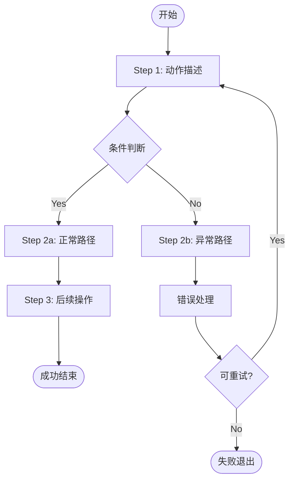

# Skill Authoring Rules (规范 1–8, 11)

> **来源：** 本文档是 skill-guide 的详细规范内容。使用 skill-guide PART 2 时自动参考。

<a name="rule-1"></a>
### 规范 1：文本表达

**原则：** 简洁、明确、无歧义。一个语句只包含一个动作或条件。

✅ **正确示例：**
```
Step 1: 运行环境检查脚本。
  命令: python3 "$SKILL_DIR/scripts/check_env.py"
  预期输出: 所有检查项显示 ✅
  如果有 ❌: 按脚本输出的提示修复后重新运行。
```

❌ **避免：**
```
首先你需要检查一下环境是否满足要求，包括Python版本、
SSH配置等，如果有问题的话按照提示来修复就好了。
```

**规则：**
- 步骤以"动词 + 宾语"开头（运行/创建/设置/检查）
- 命令必须完整可复制粘贴运行，不能有省略号或伪代码
- 预期输出和异常处理必须紧跟步骤说明

---

<a name="rule-2"></a>
### 规范 2：SKILL.md 文档结构

每个 SKILL.md 应遵循以下固定结构（顺序不变）：

```markdown
---
name: <skill-name>
description: >
  一句话功能概述（≤80字）。用于 skill 选择时的匹配。
keywords: [关键词1, 关键词2, ...]
---

# <Skill Name>

## 功能概述
<!-- 3-5句话。先说"做什么"，再说"怎么触发"，最后说"输出什么" -->

## 前置条件
<!-- 列出所有依赖：工具、权限、网络访问、其他 skill -->

## 快速开始（Step-by-step）
<!-- 每步必须包含：动作、命令、预期结果、失败处理 -->

## 配置参考
<!-- 配置项表格：字段名 | 类型 | 必填 | 默认值 | 说明 -->

## 业务流程
<!-- Mermaid 流程图 + Checklist + 异常处理表 -->

## 命令参考
<!-- 完整命令列表，每条命令附说明和示例输出 -->
```

---

<a name="rule-3"></a>
### 规范 3：脚本优先策略

**原则：** 凡是可以确定性执行的操作（环境检查、文件写入、API 调用、格式转换），都应封装为脚本，让模型只需调用，不需要理解实现细节。

**要求：**

| 操作类型 | 实现方式 |
|---|---|
| 环境 & 依赖检查 | `check_env.py`（一次性运行，输出清晰的 ✅/❌）|
| 业务主流程 | 独立 `.py` 脚本，stdin/stdout/文件 作为接口 |
| 文本格式转换 | 脚本内完成，不让模型自行拼接 |
| API 调用 | 脚本封装，返回结构化 JSON |
| 结果提交 | 单独脚本（如 `post_result.py`），模型只需传参数 |

**脚本接口规范：**

```python
# ✅ 脚本接口设计规范
# 1. 使用 argparse，每个参数都有 help 说明
# 2. 成功时 exit code=0，失败 exit code≠0（具体含义在 SKILL.md 中说明）
# 3. 结构化输出：stdout 输出 JSON（供模型解析），日志输出到 stderr
# 4. 异常情况输出 {"status": "error", "message": "..."} 而非直接 raise
# 5. 支持 --dry-run 参数，用于调试
# 6. 路径操作使用 pathlib.Path，不拼接字符串

import argparse, json, sys
from pathlib import Path

def main():
    p = argparse.ArgumentParser(description="Script description")
    p.add_argument("--workspace", required=True, help="Project workspace directory (absolute path)")
    p.add_argument("--dry-run", action="store_true", help="Print actions without executing")
    args = p.parse_args()

    workspace = Path(args.workspace)  # 不要用 os.path.join 拼接字符串

    try:
        result = do_work(workspace, args)
        print(json.dumps(result, ensure_ascii=False))
        sys.exit(0)
    except Exception as e:
        print(json.dumps({"status": "error", "message": str(e)}), file=sys.stderr)
        sys.exit(1)
```

**跨平台要求（脚本编写）：**

| 禁止 | 替代 |
|------|------|
| `os.system("kill -0 <pid>")` | `os.kill(pid, 0)` — Python stdlib，跨平台 |
| `subprocess.run(["tasklist"])` | 见下方进程检查示例 |
| 路径拼接：`dir + "/" + file` | `Path(dir) / file` |
| 硬编码 `/tmp/` | `Path(tempfile.gettempdir())` |
| `os.chmod(path, 0o755)` | 允许，但需在 Windows 上 `try/except` 忽略错误 |
| `os.fork()` | 不跨平台，使用 `subprocess.Popen` 替代 |
| `signal.SIGKILL` | 用 `process.terminate()` + `process.wait()` |

**跨平台进程存活检查（Python stdlib）：**

```python
import os

def is_process_alive(pid: int) -> bool:
    """跨平台进程存活检查（不依赖 kill 命令）"""
    try:
        os.kill(pid, 0)   # signal 0: 只检查进程是否存在，不发送信号
        return True
    except OSError:
        return False
```

---

<a name="rule-4"></a>
### 规范 4：正则约束

凡是 SKILL.md 中描述了"模型需要识别/匹配/提取某种格式"的地方，必须附上正则表达式。

**示例：**

✅ **正确 — 附正则：**
```
从脚本输出的 JSON 中读取 change_id 字段。
格式: 字母+数字，例如 "Iabcdef1234567890"
正则: ^I[0-9a-f]{40}$
若不匹配，视为无效事件，跳过处理。
```

❌ **避免 — 模糊描述：**
```
从输出中找到 change_id 并记录下来。
```

**常用正则速查表（供 SKILL.md 引用）：**

| 格式 | 正则 | 示例 |
|------|------|------|
| Gerrit Change-Id | `^I[0-9a-f]{40}$` | `Iabcdef1234...` |
| Gerrit change number | `^\d+$` | `12345` |
| Gerrit revision (commit SHA) | `^[0-9a-f]{40}$` | `abc123def...` |
| ISO 8601 时间戳 | `^\d{4}-\d{2}-\d{2}T\d{2}:\d{2}:\d{2}` | `2026-05-13T14:00:00Z` |
| HTTP URL | `^https?://[^\s]+$` | `http://127.0.0.1:8443` |
| 文件路径（POSIX） | `^/[^\0]+$` | `/home/user/config.json` |
| 文件路径（Windows） | `^[A-Za-z]:\\[^\0]*$` | `C:\Users\user\config.json` |
| 文件路径（跨平台，Python Path.is_absolute() 验证）| N/A | 使用 `Path(p).is_absolute()` |
| JSONL 行（完整） | `^\{.*\}\n$` | `{"type":"..."}\n` |
| Semantic version | `^\d+\.\d+\.\d+$` | `3.9.0` |

---

<a name="rule-5"></a>
### 规范 5：业务流程描述

**原则：** 每个业务流程必须包含以下三个要素：Checklist、Mermaid 流程图、异常处理表。

#### 5.1 Checklist 格式

```markdown
### Checklist: <步骤名称>

执行前确认：
- [ ] 条件 A 已满足（如何验证：`命令`）
- [ ] 条件 B 已满足

执行步骤：
- [ ] Step 1: <动作>  → 命令: `<command>`  → 预期: <输出描述>
- [ ] Step 2: <动作>  → 命令: `<command>`  → 预期: <输出描述>

执行后验证：
- [ ] 验证点 A: `<验证命令>` 输出包含 `<期望值>`
- [ ] 验证点 B: 文件 `<path>` 存在
```

#### 5.2 Mermaid 流程图

业务流程图模板：

````markdown

````

**要求：**
- 每个判断节点（菱形）必须有 Yes/No 两个分支
- 异常路径（红色/Error）必须显式标出
- 循环/重试路径必须有退出条件

#### 5.3 异常处理表

每个业务流程必须包含异常处理表：

```markdown
### 异常处理

| 异常情况 | 触发条件 | 处理动作 | 恢复方式 |
|----------|----------|----------|----------|
| 配置文件缺失 | `check_env.py` 输出 ❌ config | 按提示创建配置文件 | 重新运行 check_env.py |
| SSH 连接失败 | exit code ≠ 0 | 检查 SSH key 和 host | 修复后重启 listener |
| API 返回 401 | HTTP 401 | 检查 username/password | 更新配置后重试 |
| API 返回 403 | HTTP 403 | 确认账号有对应权限 | 联系 Gerrit 管理员 |
| 事件文件为空 | events.jsonl 不存在或无新行 | 检查 listener 是否运行 | 运行 ensure_listener |
```

---

<a name="rule-6"></a>
### 规范 6：快速开始步骤格式

每个 Step 必须包含以下结构（不得省略任何字段）：

```markdown
### Step N: <步骤标题>

**目的：** 一句话说明这步做什么、为什么必要。

**操作：**
\`\`\`bash
# 注释说明这条命令的作用
<完整的可运行命令>
\`\`\`

**预期输出：**
\`\`\`
<输出示例或描述>
\`\`\`

**失败处理：**
- 如果看到 `<错误信息关键词>（正则：<pattern>）`：<修复动作>
- 如果看到 `<另一种错误>`：<修复动作>
- 其他错误：<通用处理方式，如运行诊断脚本>
```

---

<a name="rule-7"></a>
### 规范 7：其他降低歧义的方法

#### 7.1 枚举值用列表，不用自然语言描述

✅ **正确：**
```
`mode` 字段取值：
- `"test"` — 仅打印报告，不提交到 Gerrit（exit code: 2）
- `"review"` — 提交 comment，不修改 Verified 标签（exit code: 0）
- `"verify"` — 提交 comment + 设置 Verified 标签（exit code: 0）
```

❌ **避免：**
```
mode 可以是测试或者正式模式，具体根据场景选择。
```

#### 7.2 Exit code 含义必须显式定义

```markdown
### Exit Code 说明

| Exit Code | 含义 | 后续动作 |
|-----------|------|----------|
| 0 | 成功 | 继续下一步 |
| 1 | 执行错误（stderr 有详情） | 查看 stderr，修复后重试 |
| 2 | test_mode 结果（需人工确认） | 查看 stdout 报告内容 |
| 3 | 配置缺失 | 运行 check_env.py |
```

#### 7.3 JSON 输出格式必须附 Schema

当脚本输出 JSON 时，SKILL.md 中必须给出完整字段定义：

```markdown
### 输出 JSON Schema（review_job.py）

\`\`\`json
{
  "status": "ok" | "error",          // 必填，执行状态
  "test_mode": true | false,          // 必填，是否测试模式
  "listener_status": "running" | "started" | "failed",  // 必填
  "events_count": <integer>,          // 必填，本次处理的事件数
  "events": [                         // 必填，数组，可为空
    {
      "change_id": "<string>",        // 格式: ^I[0-9a-f]{40}$
      "revision": "<string>",         // 格式: ^[0-9a-f]{40}$
      "project": "<string>",
      "commit_message": "<string>",
      "files": ["<filename>", ...],
      "diff": "<unified diff text>"
    }
  ],
  "message": "<string>"              // 可选，error 时的说明
}
\`\`\`
```

#### 7.4 版本依赖明确标注

```markdown
### 依赖版本要求

| 依赖 | 最低版本 | 检测命令 | 说明 |
|------|----------|----------|------|
| Python | 3.9 | `python3 --version` | 使用了 `Path \| None` 语法 |
| ssh client | any | `ssh -V` | 用于 stream-events |
| git | 2.0 | `git --version` | 用于 diff 获取 |
```

#### 7.5 配置项表格格式

```markdown
### 配置项说明

| 字段 | 类型 | 必填 | 默认值 | 说明 |
|------|------|------|--------|------|
| `gerrit.host` | string | ✅ | — | Gerrit 服务器地址，不含协议 |
| `gerrit.port` | integer | ❌ | `29418` | SSH 端口 |
| `gerrit.http_port` | integer | ❌ | `8080` | HTTP 端口 |
| `gerrit.username` | string | ✅ | — | Gerrit 账号用户名 |
| `gerrit.http_password` | string | ✅ | — | HTTP 密码（不是 SSH 密码）|
| `review.test_mode` | boolean | ❌ | `true` | `true`: 不提交，仅打印 |
```

---

<a name="rule-8"></a>
### 规范 8：Skill 自检脚本（check_env.py）要求

每个有复杂依赖的 skill，**必须**提供 `scripts/check_env.py`，满足以下要求：

```
检查内容（按顺序）：
  1. Python 版本 ≥ X.Y
  2. 必需的命令行工具（ssh/git 等）
  3. 配置文件存在且格式有效（JSON 可解析）
  4. 配置必填项均已填写（非空、非占位符）
  5. 网络连通性（如可选：尝试连接服务器）
  6. 输出目录可写

输出格式：
  每项检查输出一行：
    ✅ <检查项>: <结果>
    ❌ <检查项>: <问题> → 解决方法: <操作说明>

Exit code:
  0 = 全部通过
  1 = 有 ❌ 项（模型应停止并引导用户修复）
```

---

<a name="rule-11"></a>
### 规范 11：Harness Engineering（非正常路径与约束声明）

**原则：** 每个 skill 必须显式声明其约束、边界条件和非正常路径的处理方式。**"未声明"不等于"不会发生"**——弱模型会对未声明情况自行脑补，导致不可预期行为。

---

#### 11.1 每个 skill 必须包含"⛔ 不支持 / 不允许"声明

在 SKILL.md 的 `## 异常处理` 或 `## Troubleshooting` 之后，**必须**加一节 `## ⛔ 约束与禁止事项`，格式如下：

```markdown
## ⛔ 约束与禁止事项

### 不支持的场景（遇到时终止并告知用户）

| 场景 | 原因 | 处理动作 |
|---|---|---|
| <场景描述> | <为何不支持> | <模型应执行的动作，如"停止并提示用户"> |

### 明确禁止的操作（无论如何不得执行）

- ⛔ <禁止的操作>：<原因>
- ⛔ <禁止的操作>：<原因>
```

**最少要声明以下类别**（无论是否实际支持）：
- 并发/重入：该 skill 是否支持多个实例同时运行
- 无配置运行：缺少必填配置时的行为
- 网络不可达：服务端不可达时的行为（不得无限重试）
- 权限不足：缺少必要权限时终止并告知，不得静默跳过
- 空输入/空结果：输入为空或操作返回空结果时的处理

---

#### 11.2 非正常路径覆盖要求

每个 workflow / 步骤 checklist 必须对以下非正常路径给出**明确**处理说明（`→ 动作` 格式）：

| 非正常路径类型 | 典型触发条件 | 要求 |
|---|---|---|
| **无效输入** | 格式错误、空值、超出范围 | 用正则或类型检查拒绝，输出明确错误信息 |
| **依赖未满足** | 依赖 skill 未安装、命令不存在 | 停止执行并输出安装指引 |
| **网络/API 失败** | HTTP 5xx、超时、SSL 错误 | 最多重试 N 次（N 必须声明），超限后输出错误并终止 |
| **权限错误** | HTTP 401/403、SSH 拒绝 | 终止并提示用户检查凭据，不得重试 |
| **空结果集** | 查询无结果、列表为空 | 明确说明是"正常空结果"还是"异常空结果"，分别处理 |
| **部分失败** | 批量操作中部分成功、部分失败 | 明确说明是"继续其余项"还是"全部回滚" |
| **状态不一致** | 中途 crash 重启、重复执行 | 明确幂等性保证：是否安全重复执行 |

---

#### 11.3 边界条件必须明确标注

涉及数量、大小、长度的参数，**必须**在配置项说明或命令参考中注明边界：

```markdown
| 参数 | 类型 | 范围 | 超限行为 |
|---|---|---|---|
| max_events | int | 1–10000；默认 100 | 超过 10000 → 截断为 10000，记录 WARNING |
| hook_retries | int | 0–10；默认 3 | 超过 10 → 拒绝启动，exit 1 |
| file_path | string | 最大 4096 字符 | 超限 → 跳过该文件，记录 WARNING |
```

---

#### 11.4 幂等性声明

每个有副作用的操作（写文件、POST 到 API、修改状态）**必须**声明其幂等性：

| 声明 | 含义 | 示例 |
|---|---|---|
| ✅ 幂等 | 重复执行结果相同，无副作用累积 | `get-change`、`list-files` |
| ⚠️ 非幂等（有保护） | 脚本内部有去重/版本检查 | 写 `events.jsonl`（光标保护） |
| ❌ 非幂等（无保护） | 重复执行会产生重复副作用 | `review`（会发重复 comment） |

非幂等操作**必须**在 SKILL.md 中标注并说明如何避免重复执行。

---

<a name="section-11-5"></a>
#### 11.5 Harness Engineering Checklist（创建 skill 时自查）

在完成 SKILL.md 初稿后，逐项确认：

- [ ] 已有 `## ⛔ 约束与禁止事项` 章节，覆盖 5 类最少声明
- [ ] 每个 workflow 步骤的 checklist 包含至少一个非正常路径处理项
- [ ] 所有数量/大小参数标注了范围和超限行为
- [ ] 有副作用的操作均已声明幂等性
- [ ] 异常处理表覆盖：无效输入、依赖缺失、网络失败、权限错误、空结果、部分失败
- [ ] `check_env.py` 的非正常路径（Python 版本过低、命令不存在、配置缺失）均有 ❌ 行和修复说明

---

<a name="rule-12"></a>
### 规范 12：配置文件与环境变量策略

**适用范围：** 仅当 skill 存在需要用户配置的参数时（如服务器地址、账号、API token）才需遵守本规范。不涉及用户配置的 skill 可跳过。

**核心原则：** 同时支持 JSON 配置文件和环境变量，两者等价，配置文件优先级高于环境变量。仅当两种方式均未配置时，才引导用户。

---

#### 12.1 配置文件格式

JSON 文件，key 为环境变量名，value 为对应值：

```json
{
  "MY_SKILL_URL": "https://example.com",
  "MY_SKILL_USERNAME": "john.doe",
  "MY_SKILL_TOKEN": "your-api-token"
}
```

---

#### 12.2 配置文件搜索路径（优先级从高到低）

| 优先级 | 路径 | 说明 |
|---|---|---|
| 1（最高）| `$WORKSPACE/.config/{skill-name}.json` | 项目/agent 专属配置（多 agent 隔离） |
| 2 | `~/.config/{skill-name}.json` | 用户全局配置 |
| 3（最低）| 环境变量 | 原有方式，仍完整支持 |

> `$WORKSPACE` 在 OpenClaw 中为 agent 工作目录（`Path.cwd()`），每个 agent 独立。

---

#### 12.3 标准 Python 配置加载实现

复制以下模板到每个 skill 的脚本中（不需要共享模块）：

```python
import json, os
from pathlib import Path


def _load_file_config(skill_name: str, workspace: str | None = None) -> dict:
    """Load JSON config from workspace or home .config directory.

    Config file format: {"ENV_VAR_NAME": "value", ...}
    Returns empty dict if no config file found or on parse error.
    """
    candidates = []
    if workspace:
        candidates.append(Path(workspace) / ".config" / f"{skill_name}.json")
    candidates.append(Path.cwd() / ".config" / f"{skill_name}.json")
    candidates.append(Path.home() / ".config" / f"{skill_name}.json")

    seen, search = set(), []
    for p in candidates:
        k = str(p)
        if k not in seen:
            seen.add(k)
            search.append(p)

    for path in search:
        if path.is_file():
            try:
                data = json.loads(path.read_text(encoding="utf-8"))
                if isinstance(data, dict):
                    return data
            except (json.JSONDecodeError, OSError):
                pass  # Silently skip invalid/unreadable files — fall back to env vars
    return {}


def _get_config(key: str, cfg: dict, default: str = "") -> str:
    """Get value: config file > env var > default."""
    return cfg.get(key) or os.environ.get(key, default) or default
```

**使用示例：**

```python
def load_config(workspace: str | None = None):
    cfg = _load_file_config("my-skill", workspace)
    url   = _get_config("MY_SKILL_URL", cfg)
    token = _get_config("MY_SKILL_TOKEN", cfg)

    if not url:
        _die(
            "MY_SKILL_URL is not set.\n"
            "  Option A (config file): create $WORKSPACE/.config/my-skill.json\n"
            '    {"MY_SKILL_URL": "https://example.com", "MY_SKILL_TOKEN": "..."}\n'
            '  Option B (env var): export MY_SKILL_URL="https://example.com"'
        )
    return url, token
```

---

#### 12.4 SKILL.md 文档规范

在 Setup Checklist 的配置步骤中，用 **Option A / B** 格式并列说明两种方式：

```markdown
### Step X — Configure

Choose **one** of the two options below. Config file takes priority over env vars.

**Option A — Config file (recommended for persistent setups)**

Create `$WORKSPACE/.config/{skill-name}.json` (or `~/.config/{skill-name}.json`):

\`\`\`json
{
  "MY_SKILL_URL": "https://example.com",
  "MY_SKILL_TOKEN": "your-token"
}
\`\`\`

**Option B — Environment variables**

\`\`\`bash
export MY_SKILL_URL="https://example.com"
export MY_SKILL_TOKEN="your-token"
\`\`\`
```

---

#### 12.5 check_env.py 集成要求

`check_env.py` 需在输出中说明实际生效的配置来源：

```python
cfg = _load_file_config("my-skill")
if cfg:
    print(f"✅ 配置来源: 配置文件")
else:
    print(f"✅ 配置来源: 环境变量")
```

必填项缺失时（config 和 env 均未配置），输出 ❌ 并引导用户选择其一：

```
❌ MY_SKILL_URL 未设置
   Option A: 创建 .config/my-skill.json，添加 "MY_SKILL_URL": "https://..."
   Option B: export MY_SKILL_URL="https://example.com"
```

---

#### 12.6 注意事项

| 原则 | 说明 |
|---|---|
| 不记录凭据 | 脚本不得将 password / token 打印到 stdout/stderr |
| 配置文件非必选 | 两种方式均可；不强制用户创建配置文件 |
| 解析错误静默 | 配置文件格式错误时静默忽略，回退到环境变量，不崩溃 |
| env var 命名 | 全大写 + 下划线，前缀加 skill 名（如 `GERRIT_URL`），避免与系统变量冲突 |
| 多 agent 隔离 | 每个 agent 的 CWD 不同，`$WORKSPACE/.config/` 路径天然隔离 |
| `--workspace` 支持 | 脚本提供 `--workspace` 参数，允许覆盖 CWD 用于 config 搜索 |

---

<a name="constraints"></a>
## ⛔ 约束与禁止事项

> 本节是作者在具体 skill 文档中应保留的固定末尾结构；固定格式与说明也见 § 规范 11.1。

### 不支持的场景（遇到时终止并告知用户）

| 场景 | 原因 | 处理动作 |
|---|---|---|
| <场景描述> | <为何不支持> | <模型应执行的动作，如"停止并提示用户"> |

### 明确禁止的操作（无论如何不得执行）

- ⛔ <禁止的操作>：<原因>
- ⛔ <禁止的操作>：<原因>

---
